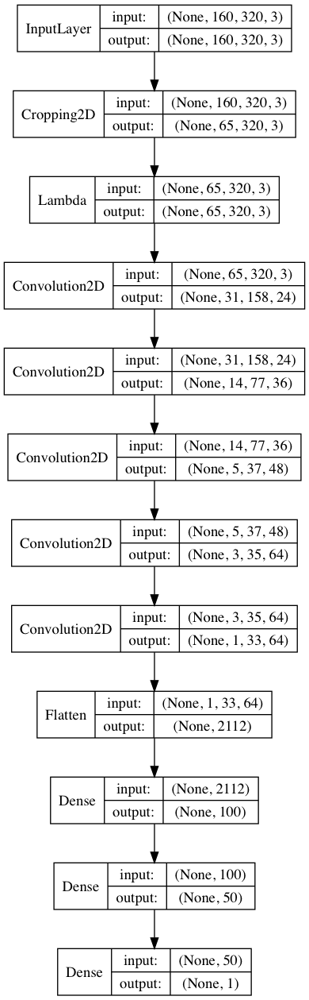
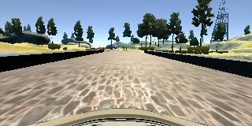
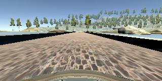
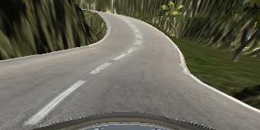
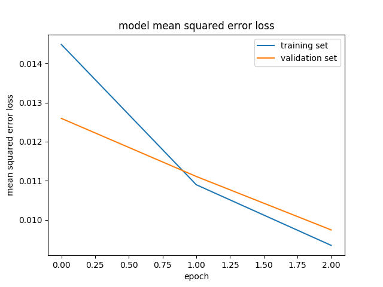

#**Behavioral Cloning** 

---

**Behavioral Cloning Project**

The goals / steps of this project are the following:

* Use the simulator to collect data of good driving behavior
* Build, a convolution neural network in Keras that predicts steering angles from images
* Train and validate the model with a training and validation set
* Test that the model successfully drives around track one without leaving the road
* Summarize the results with a written report

## Rubric Points
###Here I will consider the [rubric points](https://review.udacity.com/#!/rubrics/432/view) individually and describe how I addressed each point in my implementation.  

---
###Files Submitted & Code Quality

####1. Submission includes all required files and can be used to run the simulator in autonomous mode

My project includes the following files:

* model.py containing the script to create and train the model
* drive.py for driving the car in autonomous mode
* model.h5 containing a trained convolution neural network 
* writeup.md summarizing the results

####2. Submission includes functional code
Using the Udacity provided simulator and my drive.py file, the car can be driven autonomously around the track by executing 

```sh
python drive.py model.h5
```

####3. Submission code is usable and readable

The model.py file contains the code for training and saving the convolution neural network. The file shows the pipeline I used for training and validating the model, and it contains comments to explain how the code works.

###Model Architecture and Training Strategy

####1. An appropriate model architecture has been employed

I have chosen to normalize the data using cropping of the image to focus on the road and ignore the landscape. This was done in the model so it works later when predictions are made. I've also used lambda to zero mean the data. 

I've used NVIDIA model witch consists of 5 convolutional layers and 3 fully connected. It uses relu activations for the convolutions. 

The model look like this:  




####2. Attempts to reduce overfitting in the model

Trying to add dropouts to reduce overfitting resulted in worse car behavior, so I decided to dropout the dropouts. 
The overfitting as avoided by lowering the number of epoch. The model was tested by running it through the simulator and ensuring that the vehicle could stay on the track.

####3. Model parameter tuning

The model used an Adam optimizer, so the learning rate was not tuned manually.

####4. Appropriate training data

The final dataset chosen was to combine the Udacity provided dataset with 3 laps of my driving in the center on track 1, 4 laps driving in the opposite direction of track 1 and 2 laps of driving on track 2.  

For details about how I created the training data, see the next section. 

###Model Architecture and Training Strategy

####1. Solution Design Approach

I've started out by reproducing the code in the videos. At first I used the dataset provided from Udacity and preprocess it by adding the left and right images with a correction of 0.2. I've then added a flipped image for each of the images. That made a dataset 6 times bigger. 

It was actually enough to make a decent drive around the track with the LaNet architecture with 2 epochs. The car was sometimes continuing strait on the curve that was missing a road line on the right. 

I've then switched to NVIDIA model and the car started to behave worse. Increasing the number of epochs fixed that problem. In some cases the car couldn't turn fast enough and was exiting the road slightly. Increasing the correction for left and right images fixed that problem. 

I now had a model that was able to drive around the track without leaving it. 

####2. Final Model Architecture

I've decided to stick with NVIDIA model architecture as described above. 

####3. Creation of the Training Set & Training Process

By this point my model.py was reading each line from the csv file and was creating 6 datapoints in the dataset: center, left + correction, right + correction, and the flipped versions of the 3. 
This was all loaded in to memory, so before recording my own data I've decided to use generator for processing the data in batches. I've simply moved the logic for preprocess the data in the generator taking into account that samples_per_epoch should be 6 times the length of train_samples. This made the car drive a lot worse and just keep strait on the curves. 

The data was the same, the model was the same, but the result was a lot worse. This made me realize that I've unconsciously lowered the randomization of the data by providing 6 distinct group of features to each batch. And even though the samples ware shuffled in each batch I've still created a new pattern in the data. 

I've overcome this by separating the preprocess in 2. 

1. Creating a new list with entry for each image (center, left, right) and it steering angle. 
2. Process the image and flipped it in the generator. 

This made me realize how important shuffling the data is. 

I've then recorded 3 laps of driving on track one.



4 laps of driving backwards (meant to be 3 but I got carried away)


2 laps of driving on track 2 (it has a lot of sharp curves with is good)


I've combined my data with Udacity data witch summed up to 24574 datapoints. 
This with preprocessing made 147444 datapoints for the model to train with. 

I've chosen 3 epochs since after that validation loss start increasing. 
Here is a plot of the loss and validation loss for the model trained. 


I've end up with a model that could drive around the track for hours with no problems. 
